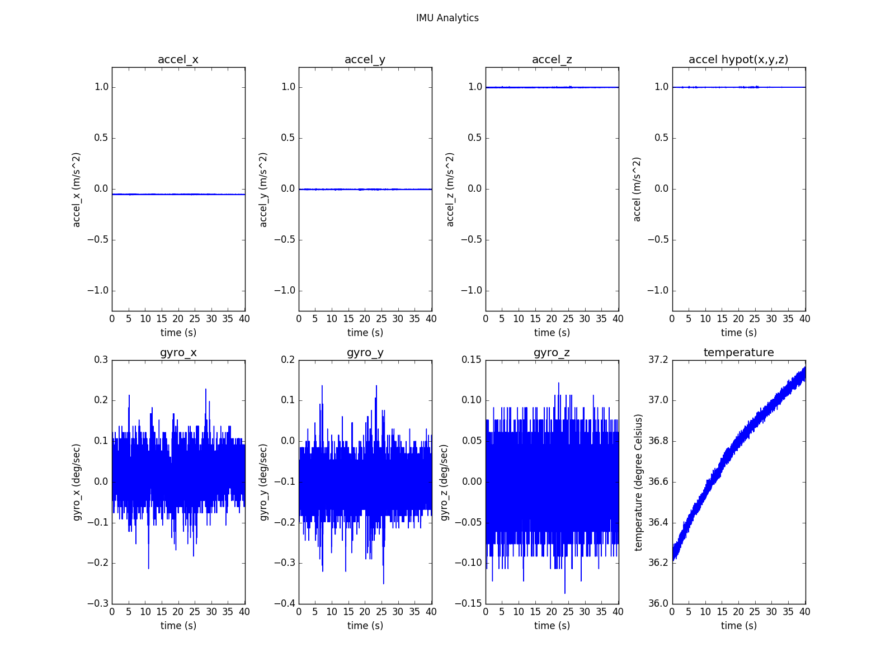

.. _analytics_imu:

Analyzing IMU
==============

The SDK provides the script ``imu_analytics.py`` for IMU analysis. The tool details can be seen in `tools/README.md <https://github.com/slightech/MYNT-EYE-S-SDK/tree/master/tools>`_ .
Refer to run commands and results on Linux:

.. code-block:: bash

  $ python tools/analytics/imu_analytics.py -i dataset -c tools/config/mynteye/mynteye_config.yaml -al=-1.2,1.2 -gl= -gdu=d -gsu=d -kl=
  imu analytics ...
    input: dataset
    outdir: dataset
    gyro_limits: None
    accel_limits: [(-1.2, 1.2), (-1.2, 1.2), (-1.2, 1.2), (-1.2, 1.2)]
    time_unit: None
    time_limits: None
    auto: False
    gyro_show_unit: d
    gyro_data_unit: d
    temp_limits: None
  open dataset ...
    imu: 20040, temp: 20040
    timebeg: 4.384450, timeend: 44.615550, duration: 40.231100
  save figure to:
    dataset/imu_analytics.png
  imu analytics done

The analysis result graph will be saved in the data set directory, as follows:

In addition, the script specific options can be executed ``-h``:

.. code-block:: bash

  $ python tools/analytics/imu_analytics.py -h
