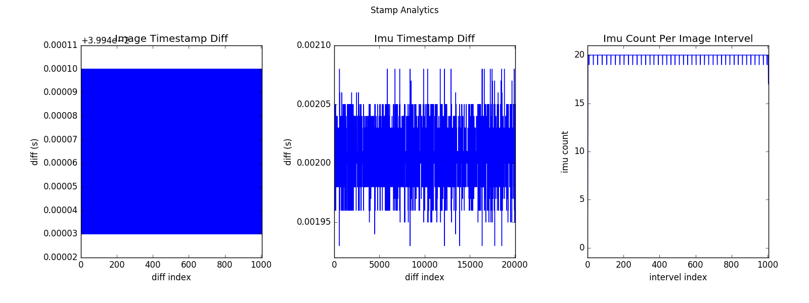

.. _analytics_stamp:

Analyze Time Stamps
====================

SDK provides a script for timestamp analysis ``stamp_analytics.py`` . Tool details are visible in `tools/README.md <https://github.com/slightech/MYNT-EYE-S-SDK/tree/master/tools>`_ .

Reference run commands and results on Linux:

.. code-block:: bash

  $ python tools/analytics/stamp_analytics.py -i dataset -c tools/config/mynteye/mynteye_config.yaml
  stamp analytics ...
    input: dataset
    outdir: dataset
  open dataset ...
  save to binary files ...
    binimg: dataset/stamp_analytics_img.bin
    binimu: dataset/stamp_analytics_imu.bin
    img: 1007, imu: 20040

  rate (Hz)
    img: 25, imu: 500
  sample period (s)
    img: 0.04, imu: 0.002

  diff count
    imgs: 1007, imus: 20040
    imgs_t_diff: 1006, imus_t_diff: 20039

  diff where (factor=0.1)
    imgs where diff > 0.04*1.1 (0)
    imgs where diff < 0.04*0.9 (0)
    imus where diff > 0.002*1.1 (0)
    imus where diff < 0.002*0.9 (0)

  image timestamp duplicates: 0

  save figure to:
    dataset/stamp_analytics.png
  stamp analytics done

The analysis result graph will be saved in the dataset directory, as follows:

In addition, the script specific options can be executed ``-h`` to understand:

.. code-block:: bash

  $ python tools/analytics/stamp_analytics.py -h

.. tip::

  Suggestions when recording data sets ``record.cc`` annotation display image inside ``cv::imshow()``, ``dataset.cc`` annotation display image inside ``cv::imwrite()`` . Because these operations are time-consuming, they can cause images to be discarded. In other words, consumption can't keep up with production, so some images are discarded. ``GetStreamDatas()`` used in ``record.cc`` only caches the latest 4 images.
