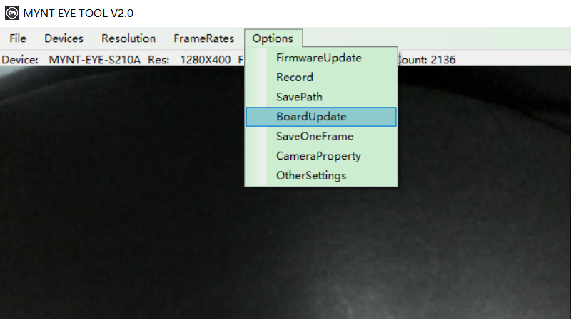

.. _firmware_stm_update:

How to upgrade the auxiliary chip
==================================

Update auxiliary chip(Only Support S2100)
------------------------------------------

* Plug in the MYNT® EYE camera into a USB3.0 port

* Open MYNT EYE TOOL and select ``Options/BoardUpdate`` .

* Click ``StmUpdate`` .

.. image:: ../../images/stmupdate.png

* In the open file selection box, select the firmware ``MYNTEYE-S210x-auxiliary-chip-v1.0.bin``  and start upgrading.

* Once the upgrade is complete, it will display update finished.

.. image:: ../../images/stmsuccess.png

