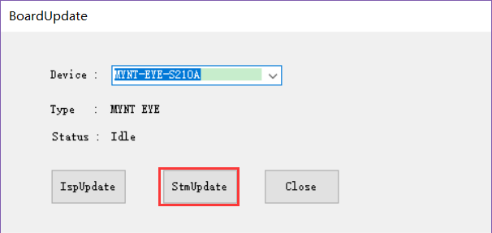
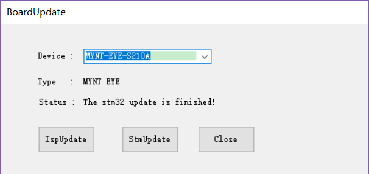

.. _fw_update_auxiliary_chip:

Update Auxiliary Chip Firmware
==================================

Update auxiliary chip (Only Support S21XX)
------------------------------------------------

* Plug in the MYNT® EYE camera into a USB3.0 port

* Open MYNT EYE TOOL and select ``Options/BoardUpdate`` .

.. image:: ../../images/firmware/boardupdate.png

* Click ``StmUpdate`` .

* In the open file selection box, select the firmware ``MYNTEYE-S21X0-auxiliary-chip-1.4.2.bin`` and start upgrading.

* Once the upgrade is complete, it will display update finished.

