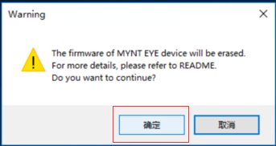

.. _fw_update_main_chip:

Update Main Chip Firmware
====================================

Please use the MYNT EYE TOOL to update main processing chip.

You can download the firmware and MYNT EYE TOOL installation package in the ``Firmwares`` folder of `MYNTEYE_BOX(Download Link) <http://doc.myntai.com/mynteye/s/download>`_ . The file structure is as follows:

.. code-block:: none

  Firmwares/
  ├─Checksum.txt             # File checksum
  ├─MYNTEYE-S1030-2.7.0.img  # S1030 firmware
  ├─MYNTEYE-S21x0-2.1.0.img  # S21X0 firmware
  ├─...
  └─mynt-eye-tool-setup.zip  # MYNT EYE TOOL zip

The firmware upgrade program currently only supports Windows, so you need to operate under Windows. Proceed as follows:

Download preparation
---------------------

* Download and unzip ``mynt-eye-tool-setup.zip``
* Find firmware, such as ``MYNTEYE-S1030-2.7.0.img``

  * Please refer to :ref:`firmware_applicable` to select the firmware suitable for the SDK version

Install MYNT EYE TOOL
---------------------

* Double click on ``setup.msi`` and install the application.

Update Firmware
---------------

* Plug in the MYNT® EYE camera into a USB3.0 port

* Open MYNT EYE TOOL and select ``Options/FirmwareUpdate`` .

.. image:: ../../images/firmware/firmware_update_option.png

* Click ``Update`` .

.. image:: ../../images/firmware/firmware_update.png
   :width: 60%

* A warning dialog box will pop up, click ``yes`` .

  * This operation will erase the firmware, for details see README.

    * Usually, the MYNT EYE TOOL automatically installs the driver during the upgrade process.
    * If the upgrade fails, refer to README.

.. image:: ../../images/firmware/firmware_update_dir.png
   :width: 60%

* In the open file selection box, select the firmware you want to upgrade and start upgrading.

.. image:: ../../images/firmware/firmware_update_select.png

* Once the upgrade is complete, the status will changes to ``Succeeded``.

.. image:: ../../images/firmware/firmware_update_success.png
   :width: 60%

* Close the MYNT EYE TOOL，finish.

.. attention::
  If you can't find MYNT image device,  ``WestBridge_driver``, and ``Cypress USB BootLoader`` at the same time in the device manager, try another computer to perform the above operation. If you can not upgrade successfully, please contact us in time.

Manually update drivers
------------------------

* If the application indicates that you failed to update, you may fail to install the driver automatically. You can try to install the driver manually and then update it. The following is the manual installation of the driver.

* Open device manager, locate ``WestBridge_driver`` device, and right click Update Driver,select ``[application directory]WestBridge_driver\\[corresponding system folders](If it is more than win7, choose wlh)\\[system bits]`` .

.. image:: ../../images/firmware/firmware_update_westbridge.png

* For example,if it is the win10 64 bit system computer,and the application is installed under the default path,you should select ``C:\Program Files (x86)\slightech\MYNT EYE TOOL 2.0\WestBridge_driver\wlh\x64``.

* After the installation driver is successful, you can find the ``Cypress USB BootLoader`` device in the device manager.

.. image:: ../../images/firmware/firmware_update_cypressUSB.png

* Then plug in the camera and open the application again to update.

.. warning::

  During the first time you open the MYNT® EYE camera after a firmware update, please hold the camera steadily for 3 seconds, for a zero drift compensation process. You can also call the API ``RunOptionAction(Option::ZERO_DRIFT_CALIBRATION)`` for zero drift correction.

.. ::

  .. image:: ../../images/firmware/firmware_update_driver.png
  .. image:: ../../images/firmware/firmware_update_driver_install.png
