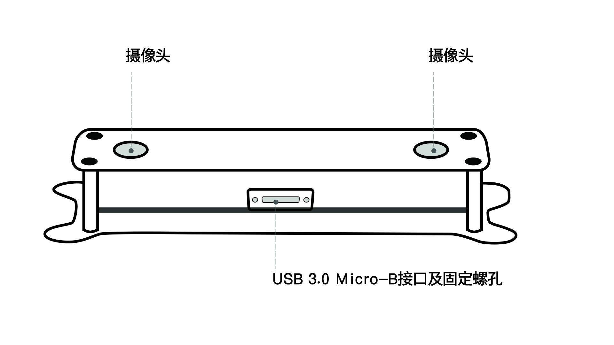

.. _mynteye_surface_s2110:

S2110 Size and Structure
================================

============= ==============
Shell(mm)     PCBA board(mm)
============= ==============
125x47x40     100x15
============= ==============

A. Camera:please pay attention to protect the camera sensor lenses, to avoid imaging quality degradation.
B. USB Micro-B interface and set screw holes: during usage, plug in the USB Micro-B cable and secure it by fastening the set screws to avoid damage to the interface and to ensure stability in connection.
