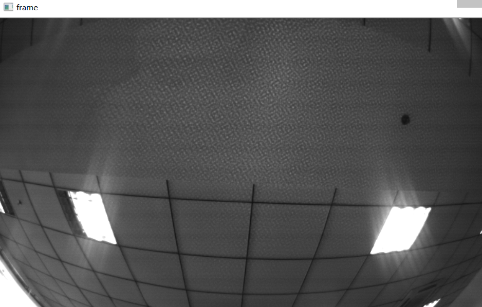

.. _infrared:

Enable IR and its adjustments function
=======================================

Using the ``SetOptionValue()`` function of the API, you can set various control values for the current open device.

Enabling IR is setting ``Option::IR_CONTROL`` greater than 0. The greater the value, the greater the IR's intensity.

.. Attention::
  * mynteye s21XX doesn't support this feature.

Reference Code:

.. code-block:: c++

  auto &&api = API::Create(argc, argv);

  // Detect infrared add-ons
  LOG(INFO) << "Support infrared: " << std::boolalpha
            << api->Supports(AddOns::INFRARED);
  LOG(INFO) << "Support infrared2: " << std::boolalpha
            << api->Supports(AddOns::INFRARED2);

  // Get infrared intensity range
  auto &&info = api->GetOptionInfo(Option::IR_CONTROL);
  LOG(INFO) << Option::IR_CONTROL << ": {" << info << "}";

  // Set infrared intensity value
  api->SetOptionValue(Option::IR_CONTROL, 80);

Reference running results on Linux:

.. code-block:: bash

  $ ./samples/_output/bin/ctrl_infrared
  I0504 16:16:28.016624 25848 utils.cc:13] Detecting MYNT EYE devices
  I0504 16:16:28.512462 25848 utils.cc:20] MYNT EYE devices:
  I0504 16:16:28.512473 25848 utils.cc:24]   index: 0, name: MYNT-EYE-S1000
  I0504 16:16:28.512477 25848 utils.cc:30] Only one MYNT EYE device, select index: 0
  I0504 16:16:28.520848 25848 infrared.cc:13] Support infrared: true
  I0504 16:16:28.520869 25848 infrared.cc:15] Support infrared2: true
  I0504 16:16:28.520889 25848 infrared.cc:20] Option::IR_CONTROL: {min: 0, max: 160, def: 0}

At this point, if the image is displayed, you can see IR speckle on the image, as below:

.. attention::

  The hardware will not record the IR value after being turned off and will reset to 0. In order to keep IR enabled, you must set the IR value after turning on the device.

Complete code samples，see `ctrl_infrared.cc <https://github.com/slightech/MYNT-EYE-S-SDK/blob/master/samples/ctrl_infrared.cc>`_ .
