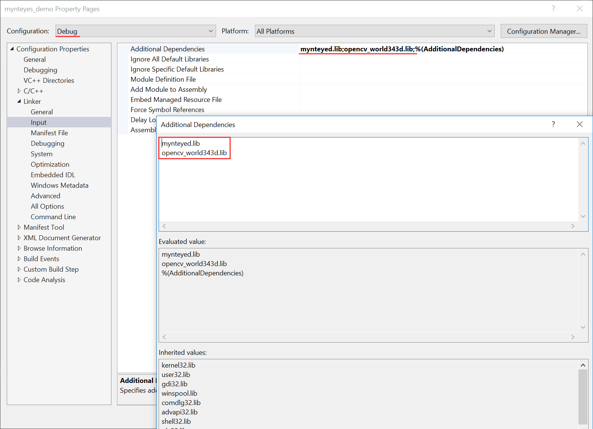

.. _vs2017:

How to use SDK with Visual Studio 2017
======================================

This tutorial will create a project with Visual Studio 2017 to start using SDK.

   You could find the project demo in ``<sdk>/samples/simple_demo/project_vs2017`` directory.

Preparation
------------

-  Windows: install the win pack of SDK

Create Project
--------------

Open Visual Studio 2017, then ``File > New > Project`` ,

.. image:: ../../../images/project/vs2017/1_new_pro.png

Select “Windows Console Application”, set the project’s name and location, click “OK”,

.. image:: ../../../images/project/vs2017/2_new_pro.png

Finally, you will see the new project like this,

.. image:: ../../../images/project/vs2017/3_new_pro.png

Config Properties
------------------

Right click the project, and open its ``Properties`` window,

.. image:: ../../../images/project/vs2017/4_config.png

Change ``Configuration`` to ``All Configurations`` , then add the following paths to ``Additional Include Directories`` ,

.. code:: bash

   $(MYNTEYES_SDK_ROOT)\include
   $(MYNTEYES_SDK_ROOT)\3rdparty\opencv\build\include

.. image:: ../../../images/project/vs2017/5_config_include.png

Add the following definitions to ``Preprocessor Definitions`` ,

.. code:: bash

   $(MYNTEYES_SDK_ROOT)\lib
   $(MYNTEYES_SDK_ROOT)\3rdparty\opencv\build\x64\vc15\lib

..  image:: ../../../images/project/vs2017/6_config_lib_dir.png

Add the following paths to ``Additional Dependencies`` ，

.. code:: bash

   mynteye.lib
   opencv_world343.lib

.. image:: ../../../images/project/vs2017/7_config_lib.png

If want to use debug mode, could change  ``Configuration`` to ``Debug`` and add following debug libs:

.. code:: bash

   mynteyed.lib
   opencv_world343d.lib

Start using SDK
---------------

Include the headers of SDK and start using its APIs,

.. image:: ../../../images/project/vs2017/9_run_x64.png

Select ``Release x64`` or ``Debug x64`` to run the project.

.. image:: ../../../images/project/vs2017/10_path.png
