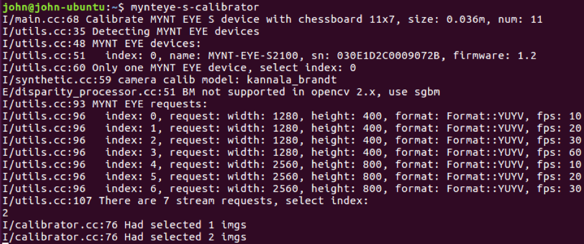
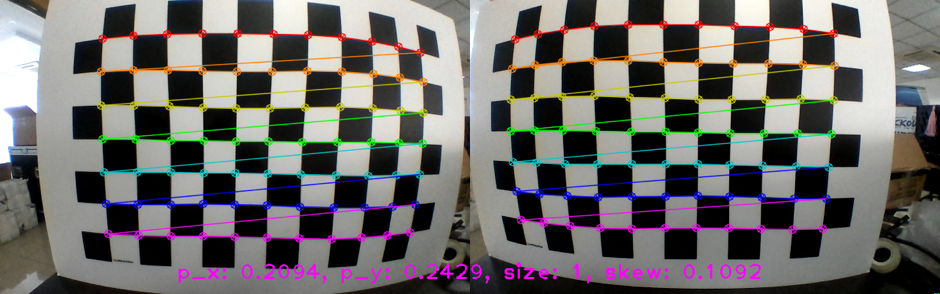
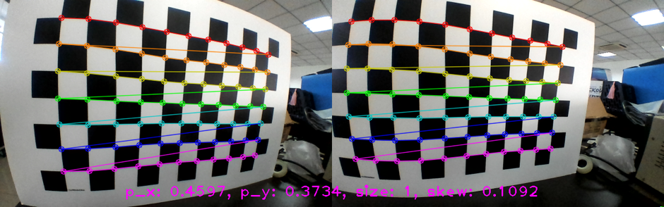
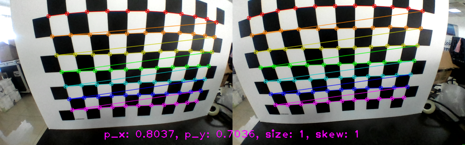
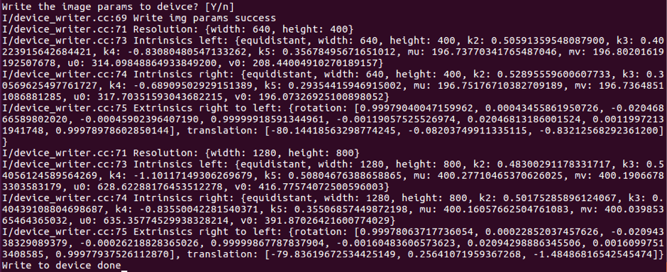

.. _calibration_tool:

Calibration Tool Manual
=======================

Introduction
--------

1.1 Support Platform
--------

Currently the calibration tool only supports Ubuntu 16.04 LTS, but support the official, ROS multiple version of OpenCV dependencies.

====================  ====================  ======================
Platform              Architecture          Different dependence
====================  ====================  ======================
Ubuntu 16.04 LTS      x64(amd64)            libopencv-dev
Ubuntu 16.04 LTS      x64(amd64)            ros-kinetic-opencv3
====================  ====================  ======================

1.2 Tools description
--------

Deb/ppa installation package is available on Ubuntu. The architecture, dependencies, and versions will be distinguished from the name:

* mynteye-s-calibrator-opencv-official-1.0.0_amd64.deb
* mynteye-s-calibrator-opencv-ros-kinetic-1.0.0_amd64.deb

=======================  ====================  ============================================================
Dependency identifier    Dependency package     Detailed description
=======================  ====================  ============================================================
opencv-official          libopencv-dev          https://packages.ubuntu.com/xenial/libopencv-dev
opencv-ros-kinetic       ros-kinetic-opencv3    http://wiki.ros.org/opencv3
=======================  ====================  ============================================================

1.3 Deb Toolkit Get
--------

====================  ========================================================================
Method of Obtaining   Get address
====================  ========================================================================
Baidu Cloud            https://pan.baidu.com/s/19rW0fPKUlQj6eldZpZFoAA  Extraction code: a6ps
Google Drive           https://drive.google.com/open?id=1RsV2WEKAsfxbn-Z5nGjk5g3ml1UDEsDc
====================  ========================================================================

Installation
--------

2.1 Installation Preparation
--------
* Ubuntu 16.04 LTS environment, x64 architecture
* Deb package for the calibration tool, select OpenCV dependencies as needed
  (this step is not required for PPA installation)

2.2 Install ppa Package
--------
.. code-block:: bash

  $ sudo add-apt-repository ppa:slightech/mynt-eye-s-sdk
  $ sudo apt-get update
  $ sudo apt-get install mynteye-s-calibrator
  $ sudo ln -sf /opt/myntai/mynteye-s-calibrator/mynteye-s-calibrator /usr/local/bin/ mynteye-s-calibrator

2.3 Install deb Package
--------
Install the deb package with udo dpkg -i:

.. code-block:: bash

  $ sudo dpkg -i mynteye-s-calibrator-opencv-official-1.0.0_amd64.deb
  ...
  (Reading database ... 359020 files and directories currently installed.)
  Preparing to unpack mynteye-s-calibrator-opencv-official-1.0.0_amd64.deb ...
  Unpacking mynteye-s-calibrator (1.0.0) over (1.0.0) ...
  Setting up mynteye-s-calibrator (1.0.0) ...

If you encounter an error that the dependency package is not installed, for example:

.. code-block:: bash

  $ sudo dpkg -i mynteye-s-calibrator-opencv-official-1.0.0_amd64.deb
  Selecting previously unselected package mynteye-s-calibrator.
  (Reading database ... 358987 files and directories currently installed.)
  Preparing to unpack mynteye-s-calibrator-opencv-official-1.0.0_amd64.deb ...
  Unpacking mynteye-s-calibrator (1.0.0) ...
  dpkg: dependency problems prevent configuration of mynteye-s-calibrator:
  mynteye-s-calibrator depends on libatlas-base-dev; however:
  Package libatlas-base-dev is not installed.
  dpkg: error processing package mynteye-s-calibrator (--install):
  dependency problems - leaving unconfigured
  Errors were encountered while processing:
  mynteye-s-calibrator

You can continue use sudo apt-get -f install to finished install

.. code-block:: bash

  $ sudo apt-get -f install
  Reading package lists... Done
  Building dependency tree
  Reading state information... Done
  Correcting dependencies... Done
  The following additional packages will be installed:
  libatlas-base-dev
  Suggested packages:
  libblas-doc liblapack-doc
  The following NEW packages will be installed:
  libatlas-base-dev
  0 upgraded, 1 newly installed, 0 to remove and 0 not upgraded.
  1 not fully installed or removed.
  Need to get 3,596 kB of archives.
  After this operation, 30.8 MB of additional disk space will be used.
  Do you want to continue? [Y/n]
  Get:1 http://cn.archive.ubuntu.com/ubuntu xenial/universe amd64 libatlas-base-dev amd64 3.10.2-9 [3,596 kB]
  Fetched 3,596 kB in 3s (1,013 kB/s)
  Selecting previously unselected package libatlas-base-dev.
  (Reading database ... 358993 files and directories currently installed.)
  Preparing to unpack .../libatlas-base-dev_3.10.2-9_amd64.deb ...
  Unpacking libatlas-base-dev (3.10.2-9) ...
  Setting up libatlas-base-dev (3.10.2-9) ...
  update-alternatives: using /usr/lib/atlas-base/atlas/libblas.so to provide /usr/lib/libblas.so (libblas.so) in auto mode
  update-alternatives: using /usr/lib/atlas-base/atlas/liblapack.so to provide /usr/lib/liblapack.so (liblapack.so) in auto mode
  Setting up mynteye-s-calibrator (1.0.0) ...

How To Use
--------

3.1 Preparation For Use
--------
* MYNT EYE S Camera
* Checkerboard
* Evenly illuminated scene

3.2 Use Command
--------

* After installing the calibration tool, you can run the `mynteye-s-calibrator` command directly on the terminal to calibrate. -h can see its options:

.. code-block:: bash

  $ mynteye-s-calibrator -h
  Usage: mynteye-s-calibrator [options]
  help: mynteye-s-calibrator -h
  calibrate: mynteye-s-calibrator -x 11 -y 7 -s 0.036
  Calibrate MYNT EYE S device.

Options:

-h, --help                  show this help message and exit
-x WIDTH, --width=WIDTH     The chessboard width, default: 11
-y HEIGHT, --height=HEIGHT  The chessboard height, default: 7
-s METERS, --square=METERS  The chessboard square size in meters, default: 0.036
-n NUMBER, --number=NUMBER  The number of imagestools to use for calibration, default: 11
-p PATH, --path=PATH        The path to save the result, default: folder name using device's SN

* -x -y -s Used to set the width, height, and grid size of the calibration plate. Width and height refer to the number of black and white intersections in the horizontal and vertical directions of the checkerboard. Square size in meters.

3.3 Steps For Usage
--------

* First, connect the MYNT EYE S camera.

* Then, run the mynteye-s-calibrator <calibration board parameter> command in the terminal.

* Follow the prompts to select an index for the camera's resolution, perform image calibration at this resolution

* The S1030 camera only need calibrate 752*480 resolution. The S2100 camera need calibrate 2560*800 and 1280*400 resolutions.

* As far as possible, let the calibration plate cover the left and right eye images of the camera,
and take care of the surroundings (maximum distortion). The calibration tool will automatically
evaluate the qualified image for the calibration calculation and will indicate on the terminal how many have been selected.

Reference acquisition image, as follows:

.. image:: ../../images/tools/calibration005.png
   :width: 60%

.. image:: ../../images/tools/calibration006.png
   :width: 60%

* Note: p_x, p_y, size, skew respectively indicate the scale of the calibration plate on the x-axis, y-axis,
  zoom, and tilt when the image is acquired. Make a point for reference.

* Once the number of images acquired by the calibration needs is reached,
  the calibration calculation will be performed. The output is as follows:

.. image:: ../../images/tools/calibration007.png
   :width: 60%

* 1.  The terminal will print out the left and right purpose calibration results.

* 2.  The calibration results will be written into the files in <SN number> directory.

    a)  camera_left.yaml: Left eye parameter
    b)  camera_right.yaml: Right eye parameter
    c)  extrinsics.yaml: Binocular external parameter
    d)  img.params.equidistant: Camera parameters, which can be used for S SDK writing
    e)  stereo_reprojection_error.yaml: Reprojection error

* Finally, you will also be asked if you want to write to the camera device. Enter or `y` to confirm

* After writing to the device, you will be prompted with "Write to device done".

3.4 Calibration result
--------
Calibration result, It is desirable to have a reprojection error of 0.2 or less. If exceeds 1, it needs to be recalibrated.

Reprojection error, visible output after calibration completion "Final reprojection error: 0.201

Pixels", or see the calibration result file "stereo_reprojection_error.yaml".

