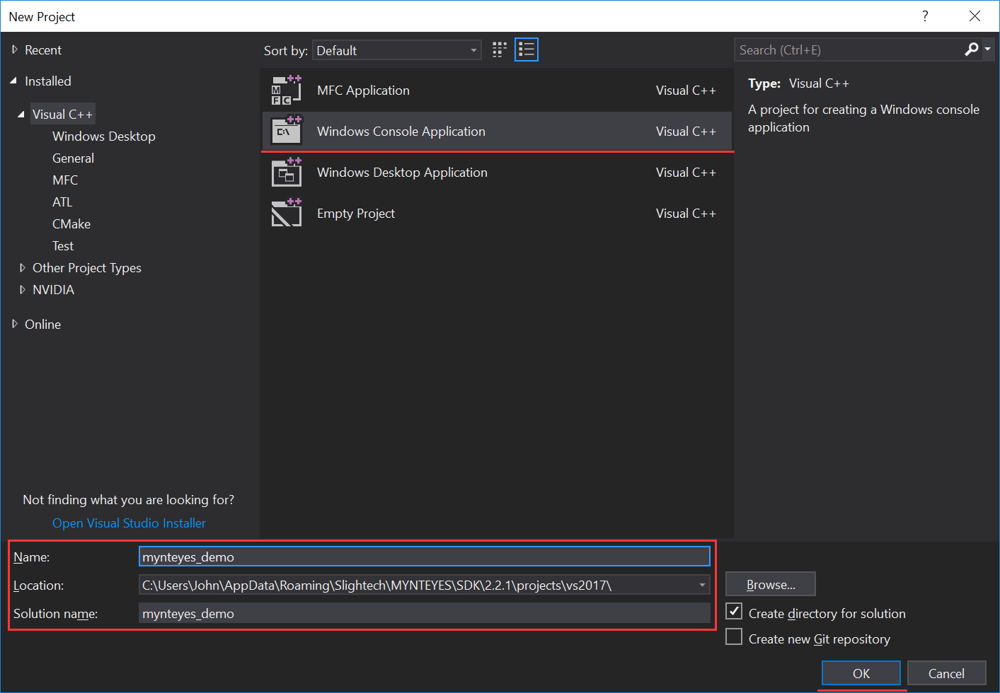
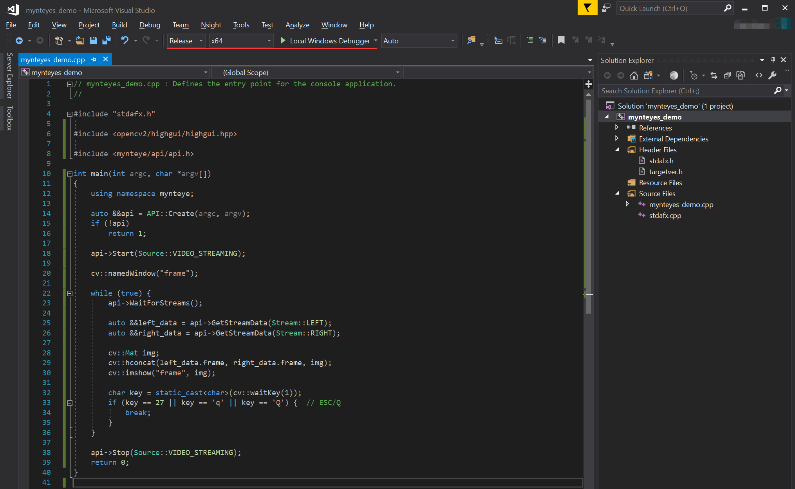

# How to use MYNT® EYE S SDK with Visual Studio 2017

This tutorial will create a project with Visual Studio 2017 to start using MYNT® EYE S SDK.

## Preparation

Install the win pack of MYNT® EYE S SDK.

## Create Project

Open Visual Studio 2017, then `File > New > Project`,


Select "Windows Console Application", set the project's name and location, click "OK",



Finally, you will see the new project like this,


## Config Properties

Right click the project, and open its "Properties" window,


Change "Configuration" to "All Configurations", then add the following paths to "Additional Include Directories",

```bash
$(MYNTEYES_SDK_ROOT)\include
$(MYNTEYES_SDK_ROOT)\3rdparty\opencv\build\include
```


Add the following paths to "Additional Library Directories",

```bash
$(MYNTEYES_SDK_ROOT)\lib
$(MYNTEYES_SDK_ROOT)\3rdparty\opencv\build\x64\vc15\lib
```


Add the following libs to "Additional Dependencies",

```bash
mynteye.lib
opencv_world343.lib
```


If you wanna debug, could change "Configuration" to "Debug" and add these debug libs,

```bash
mynteyed.lib
opencv_world343d.lib
```


## Start using SDK

Include the headers of SDK and start using its APIs,



Select "Release x64" or "Debug x64" to run the project.

<!--

-->
